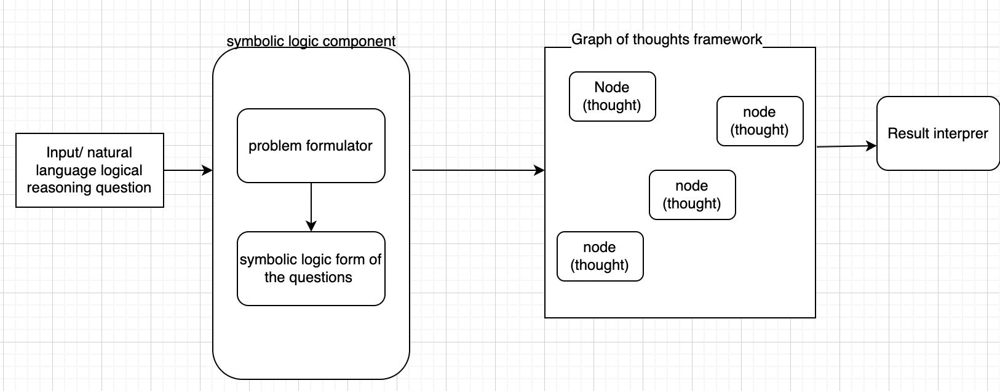
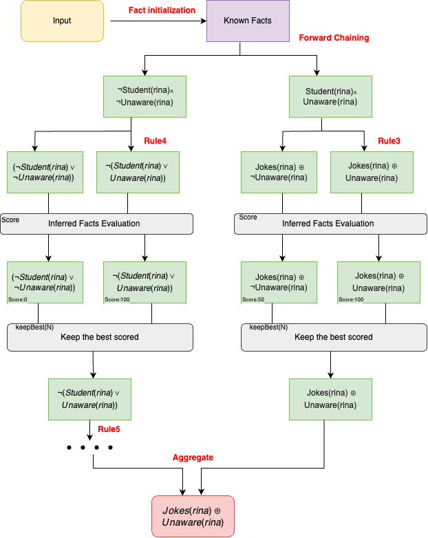

# Logic-LLM-GoT

<p align="center">
  
</p>

This implementation converts a natural language logical reasoning problem into symbolic logic using a formulator. The prompt undergoes transformation into a symbolic logic representation of the original question, which is then processed through a framework of thought graphs.

## GoT with Symbolic Logic Reasoning

This approach aims to evaluate the efficacy of the **Graph of Thoughts (GoT)** method in addressing logical reasoning problems. By integrating the power of GoT with **symbolic logic parsing**, this method offers a comprehensive solution to complex logical puzzles. The program initiates by converting the context and question of a problem into symbolic logic, extracting crucial details like premises, assumptions, and conclusions. It then proceeds to construct a semantic graph illustrating the interrelations among various concepts and propositions within the problem domain. This graph acts as a structured representation of the problem space, enabling the program to apply logical rules and inference techniques for drawing conclusions. Leveraging its understanding of symbolic logic and logical reasoning principles, the LLM navigates the graph, conducts logical operations, and deduces solutions to the given problem. Through iterative reasoning and inference processes guided by the GoT method, the program systematically explores the problem space, evaluates potential solutions, and arrives at logical conclusions.

## Logic Program Generation

To generate logic programs for logical reasoning problems in each dataset, at the root directory, run the following commands:

```bash
cd ./logic_llm_got
python models/logic_program.py \
    --api_key "Your OpenAI API Key" \
    --dataset_name "Dataset Name [ProntoQA | ProofWriter | FOLIO | LogicalDeduction ｜ AR-LSAT]" \
    --split dev \
    --model_name "Model Name [text-davinci-003 | gpt-4]" \
    --max_new_tokens 1024 \
```

The generated logic programs will be saved in `outputs/logic_programs`. You can also reuse the logic programs we generated in `./outputs/logic_programs`.

## Graph of Thoughts Implementation

### FOLIO Dataset

```bash
cd ./folio_solving
python folio_solver.py
```

### CLUTTR Dataset

```bash
cd ./cluttr_solving
python cluttr.py
```

# Graph of Logic

<p align="center">
  
</p>

This diagram gives a brief overview of the GoT implementation using Forward Chaining. The process starts out with assigning the known (initial) facts and passing them through a set of rules to derive new facts. The inferred facts are then evaluated using **Resolution Refutation**.
